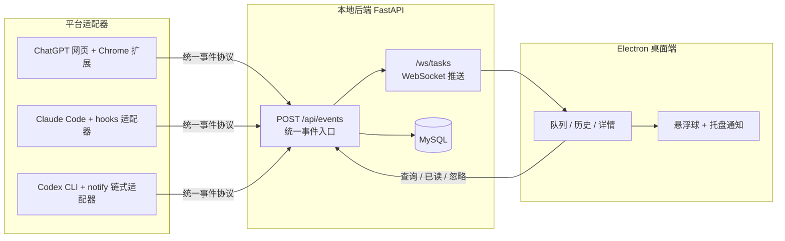
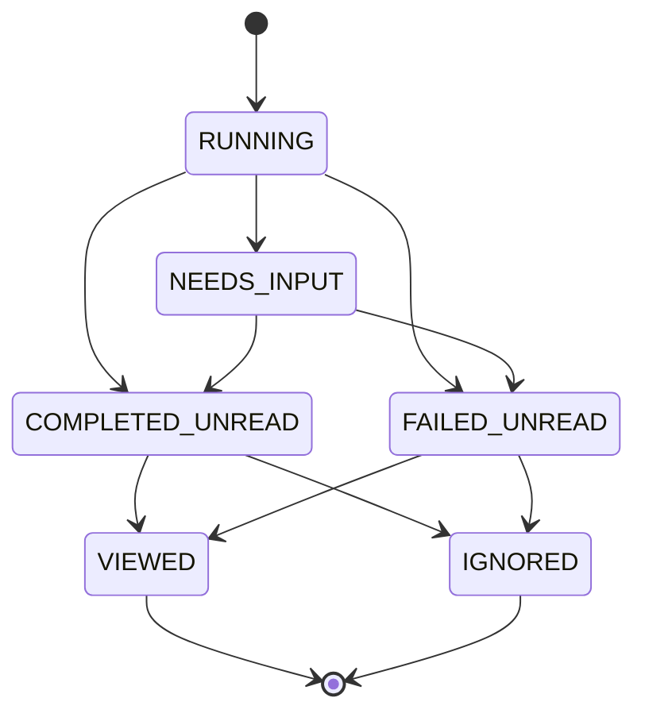
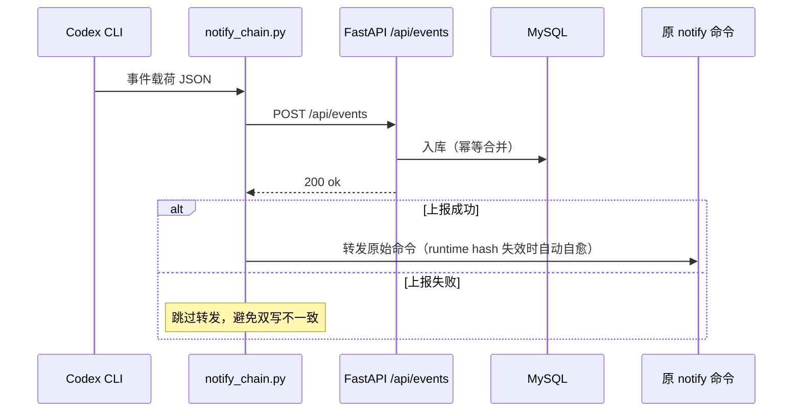

# AI Task Hub

> 多 AI 平台的本地任务中心：ChatGPT 网页 / Claude Code / Codex CLI 的任务事件统一汇入桌面队列，实时通知、一键打开对话、一键已读清理。

[](https://github.com/elaysia-feng/AI-Task-Hub/actions/workflows/ci.yml)

## 环境要求

| 依赖 | 版本 | 说明 |
|------|------|------|
| Windows | 10 / 11 | 仅支持 Windows |
| Node.js | 22+ | [下载](https://nodejs.org/) |
| Python | 3.12+ | [下载](https://www.python.org/) 或通过 `uv` 管理 |
| MySQL | 8.0+ | [下载](https://dev.mysql.com/downloads/) |
| NSIS | 3.x | **仅打包时需要**，[下载](https://nsis.sourceforge.io/Download) 或 `winget install NSIS.NSIS` |

---

## 快速开始（开发模式）

```powershell
# 1. 克隆并安装依赖
git clone https://github.com/elaysia-feng/AI-Task-Hub.git
cd AI-Task-Hub

# 2. 配置 Python 环境 + 数据库
uv venv
uv pip install -r requirements.txt
copy .env.example .env
# 编辑 .env，填入你的 MySQL 连接信息（库名建议 ai_task_hub）

# 3. 启动桌面端
cd desktop
npm install
npm run dev
```

一条 `npm run dev` 会自动：
- 检查并补装 Electron 运行时
- 启动 electron-vite 热更新开发服务
- 探测并拉起本地 Python 后端

关闭窗口会收成右下角**悬浮球**（不是退出），彻底退出请：托盘图标右键 → **退出**。

> 如果只想单独跑后端：`cd ..` → `.\.venv\Scripts\python.exe -m app.main`，然后浏览器打开 `http://127.0.0.1:17891/api/health`。

---

## 功能

- **统一队列**：ChatGPT / Claude Code / Codex CLI 的事件实时汇入桌面队列（WebSocket 推送）
- **原生通知**：Windows 通知 + 托盘未读计数，点击直达对话现场
- **悬浮球**：关闭窗口收为右下角小球，悬停看状态，拖动可移动
- **本地壁纸**：本机图片作背景，调节模糊 / 暗角 / 面板透明度
- **接入向导**：设置页一键接入 Claude Code（hooks）与 Codex（notify 链式转发）
- **事件时间线**：每个任务可展开完整生命周期事件与原始载荷
- **快速筛选**：按状态 / 来源 / 关键词组合过滤，支持排序
- **键盘操作**：`Ctrl+K` / `/` 聚焦搜索，`Esc` 关闭详情
- **自动更新**：打包版每 4 小时检查 GitHub Releases，下载后一键重启安装
- **崩溃自愈**：渲染进程崩溃自动重载，崩溃转储本地留存便于排障

## 架构



- **事件协议**：[`shared/event_schema.json`](shared/event_schema.json)
- **幂等**：`(source, externalTaskId)` 唯一约束 + generated column 折叠 NULL，重复事件合并（含平台侧无会话 ID 的场景）
- **状态机**（事件驱动，`VIEWED` / `IGNORED` 为用户操作终态）：



### Codex 通知链路（链式转发）

Codex 只支持单个 notify 命令，接入时将其改写为本仓库的 `notify_chain.py`，原命令存入 `forward_target.json` 继续转发。Codex 升级导致 runtime hash 变化时，链式适配器会按相对后缀自动重解析可执行文件（自愈），避免通知静默丢失。



---

## 本地打包 EXE 安装包

### 方式 A：命令行（推荐）

```powershell
cd desktop
npm run dist:local
```

这条命令会自动：
1. 检查 Electron 运行时（缺失则补装）
2. 检查 NSIS（缺失则给出安装指引，未安装请先 `winget install NSIS.NSIS`）
3. 检查后端 exe（缺失则**自动调用 PyInstaller 打包**）
4. 编译前端 + 生成安装包

产物在 `desktop\dist\`：

| 文件 | 用途 |
|------|------|
| `AI Task Hub Setup x.y.z.exe` | NSIS 安装向导，双击安装 |
| `AI-Task-Hub-Portable-x.y.z.exe` | 免安装便携版，双击即用 |
| `win-unpacked\AI Task Hub.exe` | 解压版，直接运行 |

### 方式 B：应用内一键打包

启动开发版 → **设置 → 应用更新 / 打包 → 生成 exe 安装包**。会自动检测 NSIS、Python、后端 exe，缺什么给什么提示。

### 双击 exe "没反应"？

应用是**单实例**的。如果已有实例在跑（托盘图标 / `npm run dev`），新进程会直接退出。请先退出所有已有实例再双击。

若 Windows 提示"已保护你的电脑"，点 **更多信息 → 仍要运行**。

---

## 测试

```powershell
# 后端测试
pytest

# 桌面端测试
cd desktop
npm test

# 端到端冒烟
cd ..
.\.venv\Scripts\python.exe scripts\e2e_smoke.py
```

---

## 数据库配置

**开发版**：复制 `.env.example` → `.env`，填入连接信息（`.env` 已被 gitignore，不会误提交）。

**安装版**：在 `%APPDATA%\AI Task Hub\config.env` 写入：

```env
AIHUB_MYSQL_HOST=127.0.0.1
AIHUB_MYSQL_PORT=3306
AIHUB_MYSQL_USER=root
AIHUB_MYSQL_PASSWORD=你的密码
AIHUB_MYSQL_DB=ai_task_hub
# 测试库（pytest 使用，可选，默认 <主库>_test）
AIHUB_MYSQL_TEST_DB=ai_task_hub_test
```

**端口**：后端端口固定 `17891`；`AIHUB_PORT` 仅供冒烟测试并行实例时覆盖**适配器上报端口**（各平台适配器默认 `17891`）。

---

## 目录结构

```
app/            # FastAPI 事件服务（api/service/repository/database 分层）
adapters/       # 平台适配器：claude-code hooks / codex notify / chatgpt 扩展
desktop/        # Electron + TypeScript 桌面端（main/preload/renderer）
packaging/      # PyInstaller spec + app.ico
scripts/        # e2e 冒烟、DB 诊断/迁移、Codex 模拟器
shared/         # 事件协议 schema 与共享常量
tests/          # pytest（状态机 / API / 集成接入 / 编码防回归）
```

---

## 发布

```powershell
git tag v0.1.8
git push origin v0.1.8
```

打 tag 后 GitHub Actions 自动构建并发布 Release。本地发版前请先跑通 `npm run dist:local` 验证。

---

## 常见问题

| 症状 | 解决方法 |
|------|---------|
| 开发怎么启动？ | `cd desktop` → `npm run dev`（见快速开始） |
| 打包报错 "makensis" 或 NSIS | 执行 `winget install NSIS.NSIS` 安装 NSIS |
| 打包报错找不到 aihub-backend.exe | 已自动化，重试 `npm run dist:local`（会自动打包后端） |
| 打包结果只有 .7z 文件，没有 .exe | NSIS 未在 PATH 中。`makensis -VERSION` 检查；安装后重新打开终端 |
| 打包 exe 双击没反应 | 先退出托盘里的已有实例，再双击 |
| 打包日志显示乱码 | 已修复（自动处理 GBK/UTF-8 编码），拉最新代码即可 |
| Codex 事件不上报 | Codex 只在启动时读配置；接入后需重启所有 Codex 进程 |
| Codex 升级后通知消失 | 已自动自愈：runtime hash 变化会重新解析可执行文件；仍失败请重新接入 |
| ChatGPT 无通知 | 确认扩展已安装且浏览器在运行 |
| 图标仍是 Python 图标 | `pwsh desktop\scripts\make-icon.ps1` 重新生成图标后重打 |

---

## License

MIT
