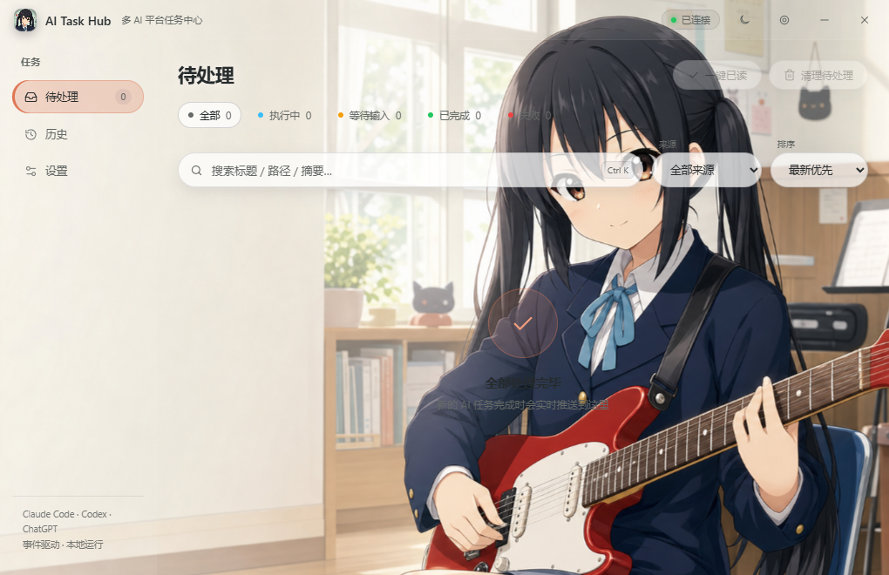
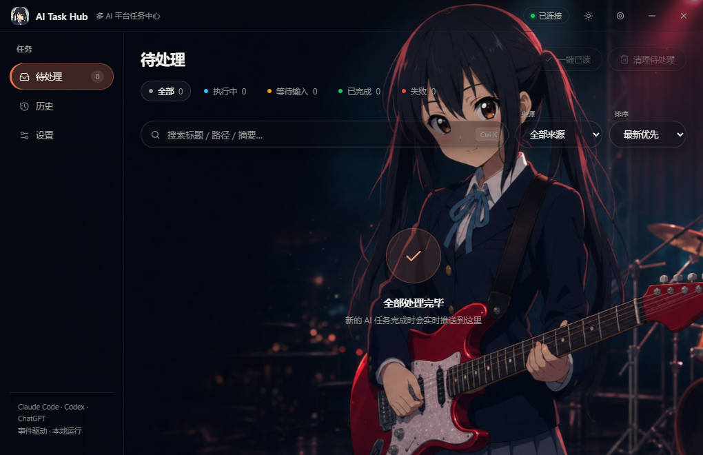
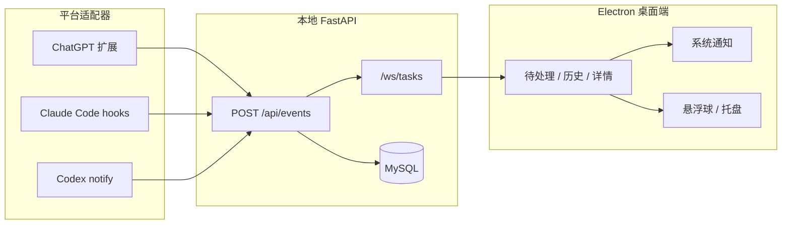

<p align="center">
  
</p>

<h1 align="center">AI Task Hub</h1>

<p align="center">
  把 ChatGPT、Claude Code 与 Codex 的异步任务，收进一个漂亮的本地收件箱。
</p>

<p align="center">
  <a href="https://github.com/elaysia-feng/AI-Task-Hub/actions/workflows/ci.yml"></a>
  
  
  
  
</p>

<p align="center">
  <picture>
    <source media="(prefers-color-scheme: dark)" srcset="docs/images/app-settings-dark.png">
    
  </picture>
</p>

<p align="center"><sub>真实 Electron 窗口 · 11 套角色主题 · Light / Dark 自动适配 · 支持本地照片</sub></p>

## 它解决什么

AI 任务跑久了，最容易错过的不是结果，而是“等待输入”“已经完成”“执行失败”这些关键节点。AI Task Hub 在本机把多个平台的事件统一成一条任务时间线，并通过桌面队列、悬浮球、托盘和 Windows 系统通知及时提醒你。

| 任务收件箱 | 原生通知 | 个性化外观 |
|---|---|---|
| ChatGPT、Claude Code、Codex 汇入同一队列 | 完成、失败、等待输入时通知，点击直达任务 | 11 套头像与 22 张 Light / Dark 壁纸，也可选择本地照片 |
| 搜索、来源筛选、状态筛选、排序 | 当前角色头像同步到通知、窗口与托盘 | 模糊、暗角、面板透明度可独立调节 |

## 界面一览

<table>
  <tr>
    <td width="50%"></td>
    <td width="50%"></td>
  </tr>
  <tr>
    <td align="center"><sub>Light：通透玻璃面板与明亮背景</sub></td>
    <td align="center"><sub>Dark：低亮度背景与高对比内容层</sub></td>
  </tr>
</table>

内置主题包括：AI 看板娘、绫波丽、海老塚智、伊蕾娜、若叶睦、丰川祥子、平泽唯、秋山澪、田井中律、琴吹紬和中野梓。每套主题都提供独立头像以及 Light / Dark 背景；也可以用自己的照片替换壁纸和应用头像。

> 角色主题为非官方同人风格视觉预设，与原作版权方无关联。公开分发前请自行确认素材使用范围。

## 核心能力

- **统一任务队列**：WebSocket 实时接收多平台事件，保留完整生命周期时间线。
- **Windows 系统通知**：使用当前应用头像、平台名称与任务摘要；点击通知或操作按钮打开任务中心。
- **悬浮球与托盘**：关闭主窗口后继续后台工作，未读状态随时可见。
- **快速定位**：支持状态、来源、关键词、排序组合筛选；`Ctrl+K` 或 `/` 聚焦搜索。
- **一键接入**：设置页检测并配置 Claude Code hooks 与 Codex notify 链路。
- **本地优先**：FastAPI 与 MySQL 均运行在本机，平台适配器只向本地事件服务上报。
- **运行自愈**：自动拉起后端、重连 WebSocket、检查 Electron 运行时并保留崩溃转储。
- **自动更新**：安装版定时检查 GitHub Releases，下载后可重启安装。

## 快速开始

### 环境

| 依赖 | 版本 | 说明 |
|---|---|---|
| Windows | 10 / 11 | 当前仅支持 Windows |
| Node.js | 22+ | 桌面端与构建工具 |
| Python | 3.12+ | 本地 FastAPI 服务 |
| MySQL | 8.0+ | 任务与事件持久化 |
| NSIS | 3.x | 仅生成安装包时需要 |

### 开发模式

```powershell
git clone https://github.com/elaysia-feng/AI-Task-Hub.git
cd AI-Task-Hub

# Python 与数据库配置
uv venv
uv pip install -r requirements.txt
Copy-Item .env.example .env
# 编辑 .env，填写 MySQL 连接信息

# 启动 Electron；后端会被自动探测并拉起
cd desktop
npm install
npm run dev
```

启动后，后端健康检查位于 `http://127.0.0.1:17891/api/health`。关闭主窗口会收成悬浮球；彻底退出请在托盘图标菜单中选择 **退出**。

只启动后端：

```powershell
.\.venv\Scripts\python.exe -m app.main
```

## 接入平台

| 平台 | 接入方式 | 说明 |
|---|---|---|
| ChatGPT | 加载 `adapters/chatgpt-extension` 浏览器扩展 | 捕获网页任务状态并上报本机 |
| Claude Code | 设置页点击接入 | 自动配置 hooks，保留现有设置 |
| Codex | 设置页点击接入 | 使用 `notify_chain.py` 上报后再转发现有 notify |

Codex 只支持一个 notify 命令，因此接入器会把旧命令保存到 `forward_target.json` 并继续链式转发。Codex runtime 路径变化后，适配器会重新解析可执行文件，避免升级后静默失效。

## 工作原理



- 事件协议：[`shared/event_schema.json`](shared/event_schema.json)
- 幂等规则：`(source, externalTaskId)` 唯一约束，重复事件合并。
- 用户终态：完成或失败任务可以标记为 `VIEWED` 或 `IGNORED`。

## 打包 Windows 应用

```powershell
cd desktop
npm run dist:local
```

脚本会检查 Electron、NSIS 和后端可执行文件，并在缺少后端 exe 时自动调用 PyInstaller。产物位于 `desktop\dist\`：

| 产物 | 用途 |
|---|---|
| `AI Task Hub Setup x.y.z.exe` | NSIS 安装向导 |
| `AI-Task-Hub-Portable-x.y.z.exe` | 免安装便携版 |
| `win-unpacked\AI Task Hub.exe` | 解压后直接运行 |

开发版也可以在 **设置 → 应用更新 / 打包 → 生成 exe 安装包** 中执行同一流程。安装版不包含源码和打包工具，因此不会开放这个入口。

## 配置

开发版复制 `.env.example` 为 `.env`。安装版在 `%APPDATA%\AI Task Hub\config.env` 中配置：

```env
AIHUB_MYSQL_HOST=127.0.0.1
AIHUB_MYSQL_PORT=3306
AIHUB_MYSQL_USER=root
AIHUB_MYSQL_PASSWORD=你的密码
AIHUB_MYSQL_DB=ai_task_hub
AIHUB_MYSQL_TEST_DB=ai_task_hub_test
```

默认后端端口为 `17891`。

## 验证

```powershell
# 后端
.\.venv\Scripts\python.exe -m pytest -q

# 桌面端
cd desktop
npm test
npm run typecheck
npm run build

# 端到端冒烟
cd ..
.\.venv\Scripts\python.exe scripts\e2e_smoke.py
```

## 项目结构

```text
app/            FastAPI API、服务、仓储与数据库
adapters/       ChatGPT、Claude Code、Codex 平台适配器
desktop/        Electron 主进程、preload 与 renderer
docs/images/    README 实机截图
packaging/      PyInstaller 配置与 Windows 图标
scripts/        冒烟、数据库诊断与辅助脚本
shared/         统一事件协议
tests/          后端与集成测试
```

## 常见问题

| 症状 | 处理方式 |
|---|---|
| 双击 exe 没反应 | 应用是单实例；先从托盘退出已有实例 |
| Windows 阻止首次运行 | 选择 **更多信息 → 仍要运行**，或给发布产物签名 |
| 报错找不到 `makensis` | 安装 NSIS：`winget install NSIS.NSIS`，然后重开终端 |
| Codex 接入后没有事件 | Codex 只在启动时读取配置；退出并重启所有 Codex 进程 |
| ChatGPT 没有通知 | 确认扩展已加载、浏览器仍在运行、本地健康检查正常 |
| 端口 `17891` 被拒绝 | 等待自动健康检查完成；仍失败时单独启动后端查看具体日志 |

## License

MIT
